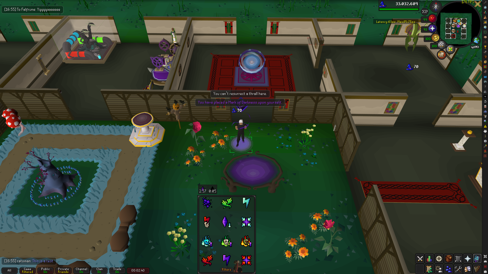

# Chat Overlay — RuneLite Plugin

Splits the OSRS chatbox into three independent overlays, each draggable and independently configurable.

## Features

### Main Chat overlay
- Shows **Public**, **Clan** (including GIM and guest clan), and **Friends Chat** messages
- Optional **Show Private Chat** toggle — when enabled, PMs appear here too (great for consolidating everything into one overlay)
- Bubble-style layout with sender name and message body in OSRS colors
- Configurable width, background color, message duration, and max message count
- Optional `[HH:MM]` timestamp prefix per message
- Messages fade out after a configurable duration; set to 0 to keep them indefinitely

### Private Chat overlay
- Separate overlay for **incoming** (`From PlayerName`) and **outgoing** (`To PlayerName`) PMs
- Positioned above the chatbox by default, out of the way of Main Chat
- Same bubble rendering as Main Chat, with its own width, background, and duration settings
- Can be combined with Main Chat via the **Show Private Chat** toggle in Main Chat settings

### Game Chat overlay
- Shows **game messages**, **engine messages**, **broadcasts**, **notifications**, and **welcome messages**
- Respects the in-game **Game chat filter setting**: when set to Filter, noisy/spam-type messages are hidden exactly as they would be in the chatbox; when set to Off, the overlay shows nothing
- Two display modes:
  - **Pinned to Player** — bubbles float above your character, always in view
  - **Free Overlay** — a draggable panel you can place anywhere
- Messages auto-expire after a configurable duration (default 5 seconds)
- **Spam filter** — suppresses repetitive messages matching configurable patterns (e.g. "you can't reach that", "nothing interesting happens")
- **Cooldown deduplication** — identical messages within a configurable window (default 3 s) are shown only once
- Optional `[HH:MM]` timestamp prefix

### General behavior
- **Chat filter sync** — the Game Chat overlay reads the same filter varbit OSRS uses, so the overlay always matches what the chatbox would show
- **Clear history sync** — right-clicking a chat tab in-game and selecting "Clear history" also clears that tab's overlay
- **Login / world-hop clear** — all overlays clear automatically on logout or world switch
- **Hide when chatbox visible** — optionally hide all overlays while the standard chatbox is open

---

## Configuration

Open **Plugin Panel → Chat Overlay** (wrench icon, search "Chat Overlay").
### Main Chat
| Setting | Default | Description |
|---|---|---|
| Show Public Chat | On | Public player messages |
| Show Clan Chat | On | Clan and GIM clan messages |
| Show Friends Chat | On | Friends Chat (FC) messages |
| Show Private Chat | Off | Also show PMs in this overlay |
| Overlay Width | 400px | Range 200–800px |
| Background Color | Black 55% | RGBA picker |
| Show Background | On | Toggle background off for a transparent look |
| Message Duration | 60s | Seconds before a message fades out (0 = never) |
| Max Messages | 10 | Maximum messages shown at once |
| Show Timestamp | On | Prefix each message with `[HH:MM]` |

### Private Chat
| Setting | Default | Description |
|---|---|---|
| Show Private Chat | On | Toggle the private chat overlay |
| Max Messages | 5 | Maximum PMs shown at once |
| Background Color | Dark purple 63% | RGBA picker |
| Show Background | On | Toggle background |
| Overlay Width | 400px | Range 200–800px |
| Message Duration | 120s | Seconds before a PM fades out (0 = never) |
| Show Timestamp | On | Prefix each message with `[HH:MM]` |

### Game Chat
| Setting | Default | Description |
|---|---|---|
| Overlay Mode | Pinned to Player | Pinned to Player or Free Overlay |
| Show Game Chat | On | Toggle the game chat overlay |
| Message Duration | 5s | Range 1–15 seconds |
| Max Visible Messages | 3 | Range 1–8 |
| Background Color | Dark gray 78% | RGBA picker |
| Filter Spam | On | Suppress messages matching the patterns below |
| Spam Patterns | (see below) | Comma-separated substrings to filter |
| Spam Cooldown | 3s | Min seconds between identical messages (0 = allow all) |
| Show Level-Up Alerts | On | Show level-up messages |
| Show Loot/Drop Alerts | On | Show drop/loot messages |
| Show Timestamp | Off | Prefix each message with `[HH:MM]` |

**Default spam patterns:** `you can't reach that`, `i can't reach that`, `nothing interesting happens`, `you can't do that right now`, `please finish what you're doing`, `you need to be closer`, `you can't use that here`

---

## Example Image
