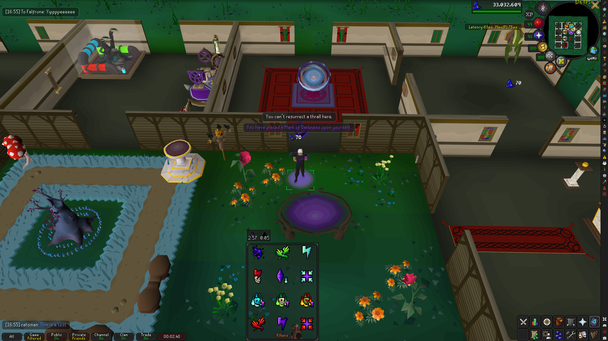

# Chat Overlay — RuneLite Plugin

Splits the OSRS chatbox into draggable, resizable, and independently configurable overlays.

## Features

### Main Chat overlay
- Shows **Public**, **Clan** (including GIM and guest clan), and **Friends Chat** messages
- Optional **Show Private Chat** toggle — when enabled, PMs appear here too (great for consolidating everything into one overlay)
- Optional **Show Game Chat** toggle — routes game/system messages into this overlay in addition to the dedicated Game Chat overlay
- Bubble-style layout with sender name and message body in OSRS colors
- Configurable width, background color, message duration, and max message count
- Optional `[HH:MM]` timestamp prefix per message
- Messages fade out after a configurable duration; set to 0 to keep them indefinitely

### Private Chat overlay
- Separate overlay for **incoming** (`From PlayerName`) and **outgoing** (`To PlayerName`) PMs
- Positioned above the chatbox by default, out of the way of Main Chat
- Same bubble rendering as Main Chat, with its own width, background, and duration settings
- Can be combined with Main Chat via the **Show Private Chat** toggle in Main Chat settings

### Game Chat overlay
- Shows **game messages**, **engine messages**, **broadcasts**, **notifications**, and **welcome messages**
- Respects the in-game **Game chat filter setting**: when set to Filter, noisy/spam-type messages are hidden exactly as they would be in the chatbox; when set to Off, the overlay shows nothing
- Two display modes:
  - **Pinned to Player** — bubbles float above your character, always in view
  - **Free Overlay** — a draggable panel you can place anywhere
- Messages auto-expire after a configurable duration (default 4 seconds)
- **Spam filter** — suppresses repetitive messages matching configurable patterns
- **Cooldown deduplication** — identical messages within a configurable window (default 3 s) are shown only once
- Optional `[HH:MM]` or `[HH:MM:SS]` timestamp prefix

### Text Styling & Accents
- Choose between multiple text styling options: **Standard**, **Shadow**, **Outline**, or **Outline + Shadow**
- **Special Pixel Font Optimization**: Custom layout metrics applied to the **RuneScape Small** font when using outline rendering to ensure text remains crisp, clean, and perfectly legible

### Peek Mode
- Hold a configurable hotkey (default: **Alt**) to instantly reveal all faded or expired messages at full opacity across every overlay
- An **amber border** is drawn around all bubbles while peeking so you can tell the mode is active
- Messages are never pruned by time — only by count — so they are always available to peek at

### Player Icons
- Ironman and J-Mod crown icons are automatically displayed between the timestamp and sender name
- Layout: `[HH:MM] [icon] Username: message`
- Icons are sourced from the game client and alpha-fade with the bubble

### Bubble Borders
- Each overlay supports an optional 1 px rounded border around every chat bubble
- Independently toggleable per overlay with its own color picker
- Overrides to amber automatically while Peek Mode is active

### General behavior
- **In-Game Chat Filter Sync** — The overlays automatically synchronize with your active in-game chat box filter buttons (Public, Private, Clan, Friends Chat, Game) using robust real-time widget checks. If a filter is turned off or hidden in-game, the overlay immediately hides it
- **Right-Click Overlay Toggles** — Right-click the in-game chat box tab buttons (**Game, Public, Clan, Private**) to instantly show/hide their respective overlays (`Chat Overlay: Show` or `Chat Overlay: Hide`)
- **Clear history sync** — Right-clicking a chat tab in-game and selecting "Clear history" also clears that tab's overlay
- **Login / world-hop clear** — All overlays clear automatically on logout or world switch
- **Hide when chatbox visible** — Optionally hide each overlay while the standard chatbox is open
- **Typing preview** — A live bubble under Main Chat shows what you are currently typing in the chatbox
